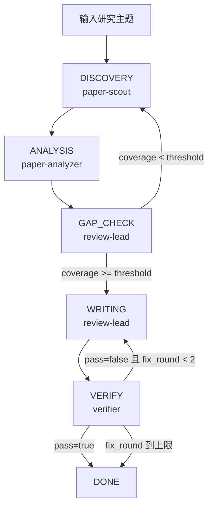

<p align="center">
  <h1 align="center">TrendR</h1>
  <p align="center"><strong>自动化文献综述 + 平台热点监控</strong></p>
  <p align="center">
    <a href="#快速开始">快速开始</a> ·
    <a href="#流程图">流程图</a> ·
    <a href="#demo">Demo</a> ·
    <a href="#运行产物">运行产物</a>
  </p>
  <p align="center">
    <a href="./README_EN.md">English</a> | 中文
  </p>
</p>

TrendR 是一个 research-agent harness：把“找论文 → 分析 → 写综述 → 验证”变成可恢复、可追踪的流水线。

## 流程图


## Demo
搜索阶段示例：


最终结果示例：


## 快速开始
### 1) 安装
```bash
git clone https://github.com/gy-hou/trendr.git
cd trendr
chmod +x install.sh
./install.sh
```

### 2) 启动一次研究
```bash
python3 cli.py run --topic "agent swarm systems" --depth B --platform codex
```

### 3) 查看状态 / 断点续跑
```bash
python3 cli.py status ~/research/agent-swarm-systems
python3 cli.py resume ~/research/agent-swarm-systems --platform codex
```

## 核心组件
| 角色 | 组件 | 职责 |
|---|---|---|
| 搜索 | `paper-scout` | 多源检索、去重、相关性评分，输出 `candidates.csv` |
| 分析 | `paper-analyzer` | 结构化抽取，输出 `notes/*.md` 和 `matrix.csv` |
| 写作 | `review-lead` | 生成 `review.md` 与 `references.bib` |
| 验证 | `verifier` | 引用、覆盖率、taxonomy 一致性检查，输出 `verify.json` |
| 编排 | `engine/state_machine.py` | `INIT → DISCOVERY → ANALYSIS → GAP_CHECK → WRITING → VERIFY → DONE` |
| 守护 | `engine/watchdog.py` | 心跳监控与恢复请求（`resume_request.json`） |

## 运行模式
| 模式 | 适用场景 | 主要依赖 |
|---|---|---|
| Basic | 快速可用、最低依赖 | Python + Node + OpenClaw/Codex/Claude Code |
| Full | 更高覆盖、更深抓取 | Basic + Obsidian + Scrapling + Zotero（可选） |

## 兼容平台与运行时
| 平台 | 入口 |
|---|---|
| OpenClaw | OpenClaw 原生多 agent |
| Codex | `python3 cli.py run --platform codex` |
| Claude Code | `python3 cli.py run --platform claude-code` |
| CLI | `python3 cli.py run --platform cli` |

运行时识别优先级：
1. `--platform`
2. `TRENDR_PLATFORM`
3. `OPENCLAW_SESSION_ID`
4. `CODEX_*`
5. `CLAUDE_CODE_*`
6. `cli`

别名：`claudecode -> claude-code`

## 运行产物
每个项目默认写入 `~/research/<project>/`：

```text
~/research/<project>/
├── candidates.csv
├── search_log.md
├── notes/*.md
├── matrix.csv
├── gap_report.md
├── review.md
├── references.bib
├── verify.json
├── run_state.json
├── progress.md
├── heartbeat.json
└── logs/
    ├── <RUN_ID>.log
    └── latest.log
```

## 平台热点监控（可选）
TrendR 支持 9 平台热点抓取（Zhihu/Xiaohongshu/X/Reddit/YouTube/GitHub/HN/Product Hunt 等），JS-heavy 页面推荐先启动 Chrome CDP：

```bash
bash scripts/start-chrome-cdp.sh
```

Lite 热点建议使用「模板 + 私有配置」两层：

```bash
# 1) 首次生成配置（公共模板 + 私有配置骨架）
python3 cli.py hotspots-template

# 2) 运行你自己的热点配置（私有兴趣词会被隐藏，不写入产物）
python3 cli.py hotspots --project-dir ~/research/my-hotspots

# 3) 快捷入口（中英文）
python3 cli.py /tr 热点
python3 cli.py /tr hot
```

默认配置路径：
- 模板（可共享）：`~/.trendr/hotspots/template.json`
- 私有配置（不建议上传）：`~/.trendr/hotspots/private.json`
- 会话元数据（用于复用状态）：`~/.trendr/hotspots/session.json`

对应 skill：
- `skills/platform-hotspots/SKILL.md`
- `skills/chrome-cdp-setup/SKILL.md`

## 常见问题
### `--platform codex` 报认证或 401
- 先执行 `codex login`
- 或设置回退 key：`OPENAI_API_KEY` / `ANTHROPIC_API_KEY`

### 报 `No model API key found`
- 说明原生会话不可用，且未配置回退 key
- 设置 `OPENAI_API_KEY`（优先）或 `ANTHROPIC_API_KEY`

### 想强制切 provider / model
```bash
export TRENDR_PROVIDER=openai   # 或 anthropic / auto
export TRENDR_MODEL=gpt-5.4-mini
```

### API 网络受限导致检索不稳
- `paper-scout` 已内置兜底链路（web_search / browser 等）
- 网络策略仍会影响覆盖率与耗时

## 文档入口
- 架构设计：`ARCHITECTURE.md`
- Runtime 约束：`AGENTS.md`
- 技能目录：`skills/*/SKILL.md`
- 测试：`tests/`

## 已知限制
- 学术 API 有速率限制，完整运行通常超过 10 分钟
- 在严格网络策略下，部分源可能失败并触发兜底
- 非前沿模型在复杂任务下稳定性较低
- 超大规模端到端科研自动化，建议使用 [K-Dense Web](https://www.k-dense.ai)

## 卸载
```bash
chmod +x uninstall.sh
./uninstall.sh
```

## 许可证
MIT
