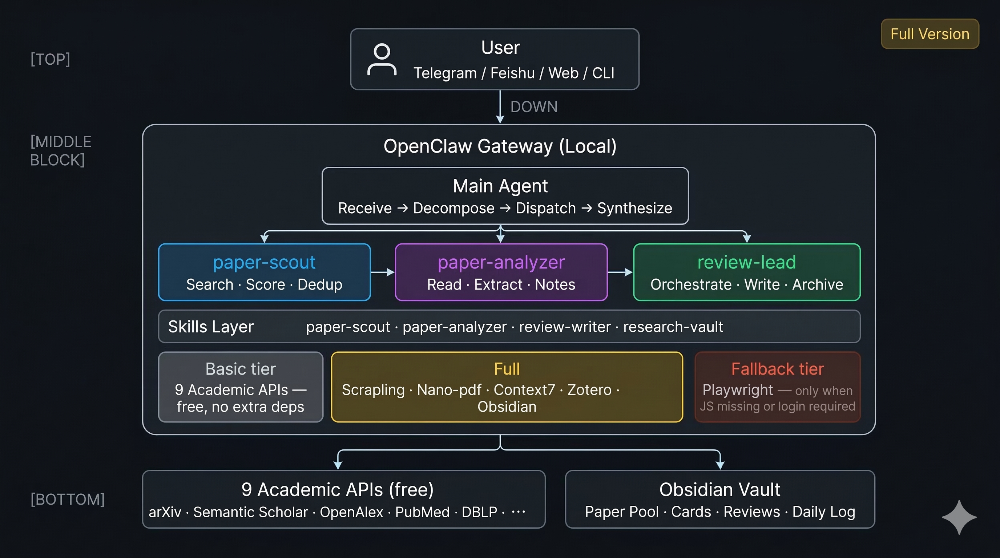
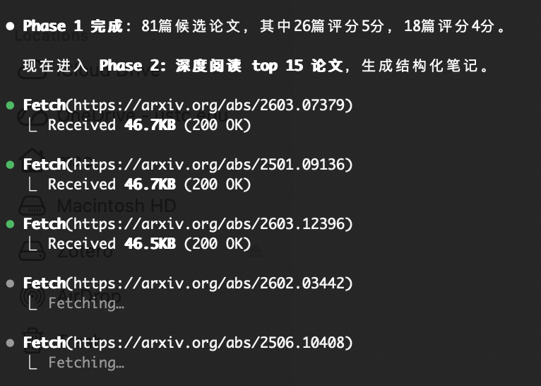
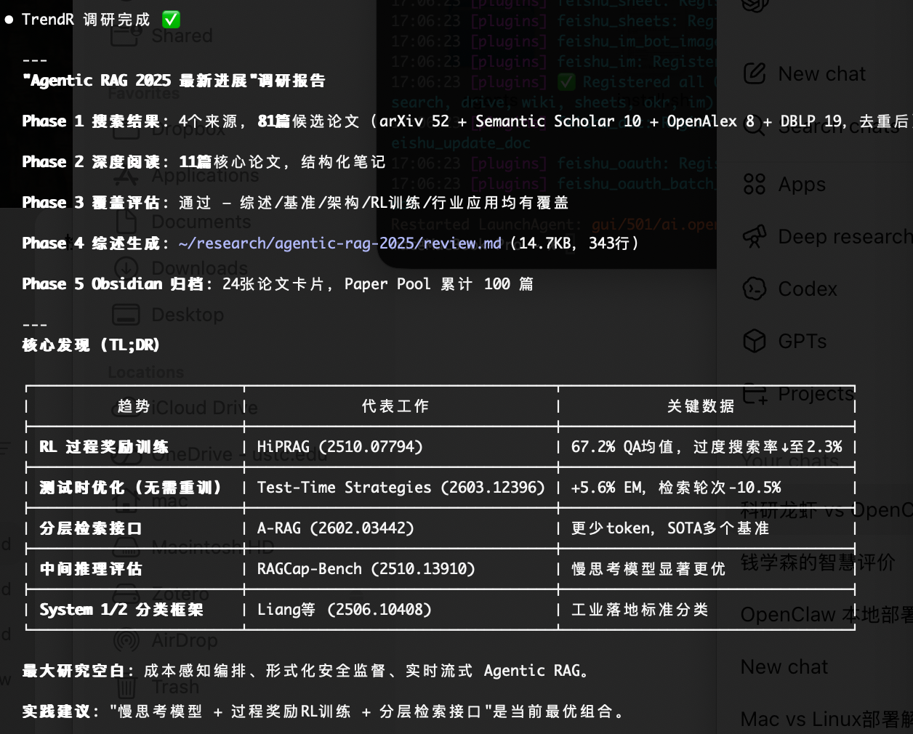

<p align="center">
  <h1 align="center">TrendR</h1>
  <p align="center"><strong>趋势研究 — 自动化文献综述 + Obsidian 知识管理</strong></p>
  <p align="center">3 个 Agent · 5 个 Skill · 9 源搜索 · Basic / Full 两档安装</p>
  <p align="center">
    <a href="#安装">安装</a> · <a href="#使用方法">使用</a> · <a href="#系统架构">架构</a>
  </p>
  <p align="center">
    <a href="./README_EN.md">English</a> | 中文
  </p>
</p>

---

告诉你的 Agent 一句话，剩下的它来做。

```
你: "调研 agentic RAG 2025 最新进展"

TrendR:
  → 9 源并行搜索，找到 81 篇候选论文
  → 精读 11 篇论文，结构化笔记 + 对比矩阵
  → 14KB 文献综述（分类体系、差距分析、BibTeX）
  → 自动归档到 Obsidian，论文池持久化
  → 通知你：完成 ✅
```

灵感来源于 [karpathy/autoresearch](https://github.com/karpathy/autoresearch) 的自主研究循环，从「LLM 训练优化」重新设计为「论文搜索 + 文献综述」。

---

## 最新更新（2026-03-24）

- 新增 `trendr-watchdog/supervisor.py`：夜间守护器，持续监控 `run_status/progress/关键产物`，卡住时自动续接。
- `watchdog.py` 改为兼容入口：旧启动命令不需要改，仍会进入新 supervisor 逻辑。
- 新增夜间报告落盘：
  - `logs/overnight_report_<RUN_ID>.md`
  - `logs/overnight_report.md`（最新镜像）
- 完成判定增强：当 `review.md + references.bib` 稳定达到阈值（默认 30 分钟）时，守护器自动退出，避免“已完成仍反复注入”。

---

<p align="center">
  
</p>

---

## 实测演示

> 主题：「调研 agentic RAG 2025 最新进展」

<p align="center">
  
  &nbsp;&nbsp;
  
</p>

<p align="center">
  <sub>左：Phase 1-2 并行抓取 arXiv 论文中 · 右：最终调研报告输出（14.7KB，含核心发现表）</sub>
</p>

---

## 它解决什么问题

| 步骤 | 手动 | TrendR |
|------|------|--------|
| 跨平台论文搜索 | 3-4 小时 | 5 分钟（9 源并行） |
| 筛选相关论文 | 2-3 小时 | 自动评分 1-5 + 去重 |
| 精读 + 做笔记 | 8-12 小时 | 结构化提取（问题/方法/结果/局限） |
| 撰写综述报告 | 6-8 小时 | 自动生成（分类体系 + 分析 + 研究空白） |
| 整理参考文献 | 1-2 小时 | 自动 BibTeX |
| 归档到知识库 | 1 小时 | 自动同步到 Obsidian |
| **合计** | **约 20-30 小时** | **约 30 分钟等待** |

---

## 包含内容

**核心（Basic + Full 均包含）**

| 类型 | 名称 | 职责 |
|------|------|------|
| Agent | `paper-scout` | 9 源搜索 + 评分 + 去重 |
| Agent | `paper-analyzer` | 精读 + 结构化笔记 + 对比矩阵 |
| Agent | `review-lead` | 编排流水线 + 撰写综述 |
| Skill | `paper-scout` | 9 个学术 API 调用手册（10KB） |
| Skill | `paper-analyzer` | 结构化提取模板 |
| Skill | `review-writer` | 综述写作模板 + 质量清单 |
| Skill | `research-vault` | Obsidian 持久化 + 论文池索引 |
| Skill | `trendr-watchdog` | 运行监督 + 超时自动续接 + 断点恢复 |

**增强层（Full 模式专属）**

| 组件 | 功能 | 关掉后效果 |
|------|------|-----------|
| Scrapling | 深挖模式：抓取 JS 渲染页面 | 仅用静态 API，覆盖率略低 |
| Zotero | 文献库同步，自动导入 DOI | BibTeX 仍可本地生成 |
| Obsidian + obsidian-cli | 论文卡片 + 综述归档 + 每日日志 | 结果存 `~/research/`，不进 Obsidian |
| Nano-pdf | 全文 PDF 精读 | 只读摘要/元数据 |
| Context7 | 给 codex-coder 提供精确库文档 | coding 任务退回 web search |

**回退层（两种模式均不默认启用）**

| 组件 | 触发条件 |
|------|---------|
| Playwright | 仅在 JS 渲染缺内容 / 登录态 / 用户明确要求时启用，不进默认检索链 |

---

## 前置要求

**Basic 模式（最低要求）**
- macOS 或 Linux
- Node.js 18+
- [OpenClaw](https://openclaw.ai) 已安装并完成 `openclaw onboard`
- OpenClaw 支持的任意 LLM（MiniMax M2.5 / Claude / GPT 等）

**Full 模式（额外依赖）**
- [Obsidian](https://obsidian.md) App + obsidian-cli（`brew install obsidian-cli`）
- Python 3 + `pip install scrapling`
- Zotero App + [API Key](https://www.zotero.org/settings/keys)
- （可选）Playwright：`npm install -g @playwright/mcp`

---

## 安装

```bash
git clone https://github.com/gy-hou/trendr.git
cd trendr
chmod +x install.sh
./install.sh
```

安装器会先展示所有组件说明和 Basic / Full 对比表，再让你选择安装模式，确认后才开始安装。

**选择 Basic：** 核心链路立刻可用，无额外工具依赖。
**选择 Full：** 自动安装 Scrapling、Obsidian CLI、Nano-pdf、Context7，并引导配置 Zotero。

自定义 Obsidian vault 路径（Full 模式）：

```bash
OBSIDIAN_VAULT="/your/vault/path" ./install.sh
```

### 本地obsidian 开启cli 

1.打开obsidian, 设置》〉通用〉》Command line interface〉》开启
2. Terminal输入
```shell
obsidian-cli set-default --vault OpenClaw-Vault
obsidian-cli print-default
```
应该显示 OpenClaw-Vault 和路径 /Users/mac/Documents/OpenClaw-Vault。
测试写入：
```shell
obsidian-cli create "test-note" --vault OpenClaw-Vault --content "# Hello from CLI"
```

### 检查openclaw UI skills 是eligible
通过本地 UI界面检查所有skills状态，哪个有问题，让AI 一个一个调试：


### 安装后：验证 openclaw.json

安装器会自动注册 Agents 和 Skills，但请确认 `~/.openclaw/openclaw.json` 包含：

**agents.list** — 三个子 Agent：

```json
{ "id": "paper-scout",    "name": "Paper Scout",    "workspace": "~/.openclaw/workspace" },
{ "id": "paper-analyzer", "name": "Paper Analyzer", "workspace": "~/.openclaw/workspace" },
{ "id": "review-lead",    "name": "Review Lead",    "workspace": "~/.openclaw/workspace" }
```

**maxTokens** >= 32768（否则 analyzer 输出会被截断）

然后：

```bash
openclaw gateway restart
```

---

## 使用方法

```bash
# 新建文献综述
"调研 [主题] 的最新进展"

# 搜索论文
"搜索关于自主 AI Agent 的论文，聚焦 2024-2025，偏好有代码的"

# 查询论文池
"在我的论文池中查找关于 transformer 的论文"
"按项目统计论文池"

# 继续一个项目
"继续 rl-multi-agent-finance 项目，新增做市方向"

# 同步到 Obsidian
"将研究成果同步到 Obsidian"

# 每日追踪
"设置每天早上 9 点的 arXiv cs.AI 追踪"
```

### 交互式入口（/trendr）

输入 `/trendr` 后，默认进入快速模式；若要进入精确模式，输入 `/b`。

- 研究主题：一句话描述研究问题（必填）
- 研究轮次：`A=1-3` / `B=3-6` / `C=6-10`
- 研究程度：`A=API 标准检索（快）` / `B=API + Scrapling（更全）` / `C=API + Scrapling + Tavily（常规最强）`
- 可接受时长：用户输入分钟数
- 用户可以只输入字母选项（A/B/C）
- 示例：`主题：RL 多智能体做市；B / B / 60`

TrendR 会先给出估时与计划调整：

- 若时间预算明显不足（< 预计耗时 70%），先降轮次，再降源头规模
- 回显预计完成时间（本地时区）
- 二次确认“是否确认执行？（y / n）”

### 运行进度与日志

每次运行会在项目目录产出并持续刷新：

- `run_status.json`：机器可读状态（phase、百分比、开始时间、预计剩余）
- `progress.md`：人类可读进度条（Phase 1-5）
- `logs/<RUN_ID>.log`：本次运行完整日志（用于复盘纠错）
- `logs/latest.log`：最近一次运行日志快照
- `logs/supervisor_<RUN_ID>.json`：守夜状态（注入次数、最近原因、停止原因）
- `logs/overnight_report_<RUN_ID>.md`：夜间守护报告（停机原因、当前 phase、建议下一步）
- `logs/overnight_report.md`：最新夜间守护报告镜像
- `logs/watchdog.out`：watchdog 后台输出

默认心跳频率：每 5-10 分钟至少更新一次状态与日志。  
自动续接阈值：10 分钟无活动，或“文件已进入下一 phase 但 phase 字段 3 分钟未推进”。  
提前完成收手：当 `review.md + references.bib` 稳定达到阈值（默认 30 分钟）时，supervisor 自动退出。

---

## 系统架构

### 整体概览

```
┌─────────────────────────────────────────────────────────────────┐
│                            用户                                   │
│                   Telegram / 飞书 / Web / CLI                     │
└──────────────────────────┬──────────────────────────────────────┘
                            ▼
┌─────────────────────────────────────────────────────────────────┐
│                 OpenClaw Gateway（本地运行）                        │
│                                                                 │
│  ┌─ main agent ──────────────────────────────────────────────┐  │
│  │       接收 → 分解 → 分派 → 综合                              │  │
│  └──────┬───────────────┬────────────────┬────────────────────┘  │
│         ▼               ▼                ▼                       │
│  ┌────────────┐  ┌────────────┐  ┌─────────────┐               │
│  │paper-scout │  │paper-      │  │review-lead  │               │
│  │ 搜索 评分  │  │analyzer    │  │ 编排 综述   │               │
│  │ 去重       │  │ 精读 提取  │  │ 归档 通知   │               │
│  └─────┬──────┘  └─────┬──────┘  └──────┬──────┘               │
│        │               │                │                       │
│  ┌─────▼───────────────▼────────────────▼──────────────────┐   │
│  │            Skills（可执行的 Markdown 知识文件）              │   │
│  │  paper-scout · paper-analyzer · review-writer · vault   │   │
│  │  + trendr-watchdog（运行监督与自动续接）                  │   │
│  └──────────────────────────┬──────────────────────────────┘   │
│                             ▼                                   │
│  ┌──────────────────────────────────────────────────────────┐   │
│  │  工具层 (exec / web_fetch / read / write / browser)       │   │
│  ├──────────────────────────────────────────────────────────┤   │
│  │  Basic:  9×学术API（免费直连，无额外依赖）                    │   │
│  │  Full:   + Scrapling（JS渲染） + Nano-pdf（PDF全文）        │   │
│  │          + Context7（库文档） + Zotero（文献库）             │   │
│  │  Fallback: Playwright（仅JS缺失/登录态时触发）               │   │
│  └──────────────────────────────────────────────────────────┘   │
└────────────┬────────────────────────────┬───────────────────────┘
             ▼                            ▼
  ┌─────────────────────┐     ┌────────────────────────────┐
  │  9 个学术 API（免费） │     │  Obsidian Vault             │
  │  arXiv · S2 · OA    │     │  论文池 / 卡片 / 综述 / 日志  │
  │  PubMed · DBLP ···  │     └────────────────────────────┘
  └─────────────────────┘
```

### 流水线

```
  用户一句话
      │
      ▼
┌─ Phase 1: 搜索 ─────────────────────────────────────────┐
│  paper-scout 并行调用 3-5 个最相关 API                     │
│  → candidates.csv（40-100 篇，含相关度评分 1-5）            │
│  → search_log.md                                        │
└──────────────────────────────┬──────────────────────────┘
                               ▼
┌─ Phase 2: 精读 ─────────────────────────────────────────┐
│  paper-analyzer 深度阅读评分 ≥ 4 的论文                    │
│  → notes/*.md（结构化笔记：问题/方法/结果/局限）              │
│  → matrix.csv（多维对比矩阵）                              │
└──────────────────────────────┬──────────────────────────┘
                               ▼
┌─ Phase 3: 差距检查 ──────────────────────────────────────┐
│  论文数量 / 主题覆盖不足？ ──→ 回 Phase 1（调整搜索策略）     │
│  覆盖充分？ ──────────────→ Phase 4                      │
└──────────────────────────────┬──────────────────────────┘
                               ▼
┌─ Phase 4: 撰写综述 ──────────────────────────────────────┐
│  review-lead 生成完整文献综述                               │
│  → review.md（15-25KB，含分类体系 / 差距分析 / 趋势）        │
│  → references.bib                                       │
└──────────────────────────────┬──────────────────────────┘
                               ▼
┌─ Phase 5: 持久化 ────────────────────────────────────────┐
│  Basic:  ~/research/<project>/  本地存储                  │
│  Full:   Obsidian paper-pool.csv（累积去重，跨项目）         │
│          Obsidian papers/*.md（论文卡片 + wiki-links）      │
│          Obsidian reviews/project/（综述归档）              │
│          Obsidian daily/date.md（研究日志）                 │
│          Zotero 文献库自动同步                              │
└──────────────────────────────┬──────────────────────────┘
                               ▼
                   通知用户（Telegram / 飞书）
```

### 9 源搜索覆盖

所有 API 均为公开免费，通过 `web_fetch` 直接调用——无需额外 MCP 服务：

| # | 来源 | 覆盖范围 | 需要密钥 |
|---|------|----------|---------|
| 1 | arXiv | 计算机/数学/物理预印本 | 否 |
| 2 | Semantic Scholar | 2 亿+ 论文，引用图谱 | 推荐（免费） |
| 3 | OpenAlex | 2.5 亿+ 作品，完全开放 | 否 |
| 4 | PubMed | 3600 万+ 生物医学 | 否 |
| 5 | CrossRef | 1.4 亿+ DOI 注册 | 否 |
| 6 | DBLP | 计算机科学文献 | 否 |
| 7 | Europe PMC | 4000 万+ 生命科学 | 否 |
| 8 | bioRxiv | 生物学预印本 | 否 |
| 9 | Papers with Code | ML 论文 + 代码仓库 | 否 |

Agent 根据研究领域自动选择 3-5 个最相关的来源。

### Obsidian 知识库

```
[Vault]/Research/
├── _index/
│   └── paper-pool.csv          ← 论文池（跨项目累积）
├── papers/
│   └── 2301.12345.md           ← 论文卡片（YAML frontmatter + wiki-links）
├── reviews/
│   └── project-name/
│       ├── review.md
│       ├── references.bib
│       └── matrix.csv
├── daily/
│   └── 2026-03-10.md           ← 每日研究日志
└── templates/
```

论文池 CSV 追踪状态流转：`candidate` → `analyzed` → `cited_in_review`

### 防遗忘机制

使用非前沿模型（如 MiniMax M2.5）时，Agent 可能忘记读取 Skill 文件。TrendR 采用三层防御：

| 层级 | 机制 |
|------|------|
| AGENTS.md | 硬编码规则："任务描述必须包含 '先读 skills/xxx/SKILL.md'" |
| SOUL.md | 顶部警告："⚠️ 第一步：读 skills/xxx/SKILL.md" |
| SKILL.md | 完整的可复制粘贴命令，而非抽象指令 |

## 自定义

TrendR 的核心逻辑全部写在 Skill 文件里（Markdown），可以直接编辑，无需改代码。

**添加搜索源**

编辑 `skills/paper-scout/SKILL.md`，按现有格式添加新的 `web_fetch` 调用。每个 API 块包含：URL 模板、参数说明、返回字段解析。

**修改综述结构**

编辑 `skills/review-writer/SKILL.md`，调整章节模板、质量清单、BibTeX 格式规则。

**修改论文笔记字段**

编辑 `skills/paper-analyzer/SKILL.md`，增减提取维度（如新增"数据集"字段或"可复现性"评分）。

**切换模型**

TrendR 与模型无关，在 `openclaw.json` 中配置即可：
```json
{ "model": "minimax-m2.5" }   // 低成本（约 ¥0-7/次）
{ "model": "claude-opus-4-6" } // 高质量
{ "model": "gpt-4o" }          // 备选
```

**扩展 Full 模式工具链**

在 `install.sh` 的 Full 安装段中添加自定义工具的安装和注册逻辑，遵循 `_ensure_skill()` 函数的模式。

**每日论文追踪**

告诉你的 Agent："设置每天早上 9 点的 arXiv cs.AI 追踪"，Agent 会自动配置定时任务。

---

## 已知局限

- **非实时**：学术 API 有速率限制（arXiv: 3 秒/请求）；完整搜索需要几分钟
- **网络策略差异会影响时长**：部分代理/DNS 会把学术域名解析到 `198.18.x.x`（fake-ip），`web_fetch` 可能被安全策略拦截；TrendR 已加入自动兜底检索，但覆盖率仍会下降
- **非前沿模型可能遗忘**：MiniMax M2.5 有时会跳过 Skill 文件，尽管有三层防御
- **全文阅读（Basic 模式）**：仅读摘要页；Full 模式开启 Nano-pdf 可精读 PDF 全文
- **Zotero / Obsidian（Basic 模式）**：Basic 不含持久化；Full 模式自动配置
- **无双 AI 审稿**：可扩展（参考 paper-distill-mcp 的双审模式）

---

## 卸载

```bash
chmod +x uninstall.sh
./uninstall.sh
```

你的 Obsidian 研究数据和 `~/research/` 会被保留。

---

## 致谢

- [karpathy/autoresearch](https://github.com/karpathy/autoresearch) — 自主研究循环的灵感来源
- [paper-distill-mcp](https://github.com/Eclipse-Cj/paper-distill-mcp) — 多源搜索架构参考
- [OpenClaw](https://openclaw.ai) — Agent 运行时基础设施

## 许可证

MIT
